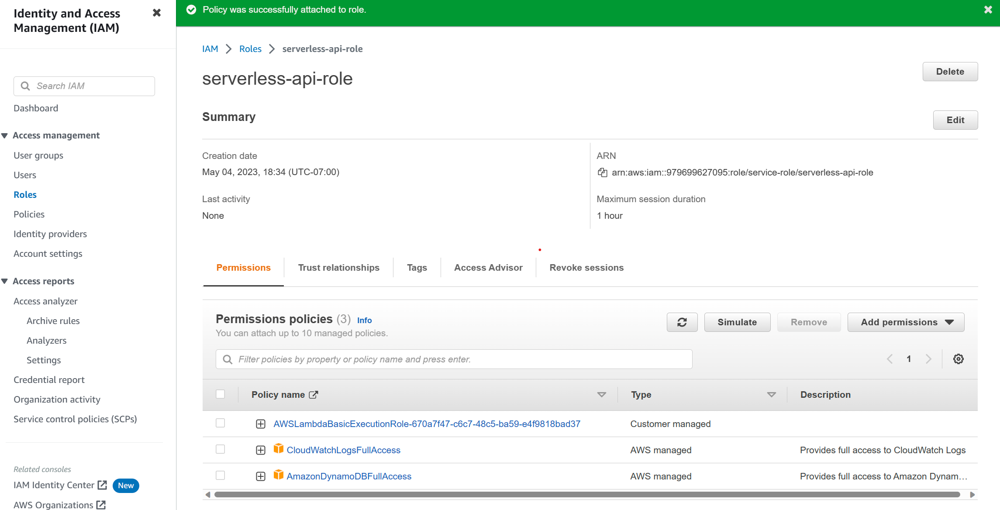

# HackCloud Session 3: Serverless Computing

**Date**: May 4, 2023

**Location**: Engineering VI 289

**Teachers**: [Andy Lewis](https://github.com/datowq), [Einar Balan](https://github.com/EinarBalan)

## Resources

- [Slides](https://docs.google.com/presentation/d/1Ks0vzlODk4IIa13j1mklLcv2dN6veaHb4swsVQ57zlQ/edit?usp=sharing)
- [Workshop recording](https://youtu.be/_wzJBDLTmro)

## What we'll be learning today

- [Demo: CRUD Serverless API](#demo-crud-serverless-api)

## Demo: CRUD Serverless API

To start, make sure you have created an AWS account and sign in to the console.

#### Create DynamoDB table

Go to **Services > DynamoDB**, and then click **Create table**  in the **Get started** box.


Our table will be called `product-inventory` with `productid` as our **partition key**.
We will use default settings so just hit **Create table**.
Simple!


#### Create an AWS Lambda function

Go to **Services > Lambda**, and then click **Create a function**  in the **Get started** box.
[link to lambda](https://us-west-1.console.aws.amazon.com/lambda/home?region=us-west-1#/begin)


Make sure to have **Author from scratch** selected.
For this demo, our function name is `serverless-api` with `Node.js 16.x` as our runtime and `x86_64` as our architecture.


Our function also needs a new **default execution role**, so under the drop down, select **Create a new role from AWS policy templates**.
Our **role name** will be `serverless-api-role` and we will keep the policy templates blank.


Hit **Create function** to create our AWS Lambda function!

In order to allow our API to interface with our table and logging, we will need to configure our `serverless-api-role` to have proper access to our DynamoDB and CloudWatchLogs.
In the AWS Lambda page for our `serverless-api` go to **Configuration > Permissions**.
We will then want to click on our **Role name**, which will take us to the **IAM Management Console**.

 

To add proper permission policies, we want to go to **Add permissions > Attach policies** and then add the **AmazonDynamoDBFullAccess** and **CloudWatchLogsFullAccess** policies, which can be found by using the search.
Then, hit **Add permissions** and your permissions policies table should look like:



As far as configuration goes, our AWS Lambda function is setup!


#### Create a REST API with AWS API Gateway

Go to **Services > API Gateway**, and then scroll down and click **Build**  under the **REST API** box (the one that is not private).


(the one that is highlighted)

Make sure you have `REST` set as the protocol, and then select `New API`.
Our **API name** will be `serverless-api`.
Then, hit **Create API*.


Creation of our API will be rather repetitive.
We will be defining our endpoints (known as resources) and which CRUD operations can be performed on each endpoint (known as methods).
Create three seperate resources `health`, `products`, and `product` each will API Gateway CORS.


Before creating the methods, each method should have `Use Lambda Proxy integration` selected, with the **Lambda Function** as `serverless-api`.

The `/health` endpoint should have a GET method.
The `/products` endpoint should also have a GET method.
The `/product` endpoint should have a GET, POST, PATCH, and DELETE method.
Your resource tree should look like this:


To deploy our API, go to **Actions > Deploy API** (on the left menu) and create a stage named `prod`.


Now, go back to your Lambda funciton and copy this code:

```JS
const AWS = require('aws-sdk');
AWS.config.update( {
  region: 'us-east-1'
});
const dynamodb = new AWS.DynamoDB.DocumentClient();
const dynamodbTableName = 'product-inventory';
const healthPath = '/health';
const productPath = '/product';
const productsPath = '/products';

exports.handler = async function(event) {
  console.log('Request event: ', event);
  let response;
  switch(true) {
    case event.httpMethod === 'GET' && event.path === healthPath:
      response = buildResponse(200);
      break;
    case event.httpMethod === 'GET' && event.path === productPath:
      response = await getProduct(event.queryStringParameters.productId);
      break;
    case event.httpMethod === 'GET' && event.path === productsPath:
      response = await getProducts();
      break;
    case event.httpMethod === 'POST' && event.path === productPath:
      response = await saveProduct(JSON.parse(event.body));
      break;
    case event.httpMethod === 'PATCH' && event.path === productPath:
      const requestBody = JSON.parse(event.body);
      response = await modifyProduct(requestBody.productId, requestBody.updateKey, requestBody.updateValue);
      break;
    case event.httpMethod === 'DELETE' && event.path === productPath:
      response = await deleteProduct(JSON.parse(event.body).productId);
      break;
    default:
      response = buildResponse(404, '404 Not Found');
  }
  return response;
}

async function getProduct(productId) {
  const params = {
    TableName: dynamodbTableName,
    Key: {
      'productId': productId
    }
  }
  return await dynamodb.get(params).promise().then((response) => {
    return buildResponse(200, response.Item);
  }, (error) => {
    console.error('Do your custom error handling here. I am just gonna log it: ', error);
  });
}

async function getProducts() {
  const params = {
    TableName: dynamodbTableName
  }
  const allProducts = await scanDynamoRecords(params, []);
  const body = {
    products: allProducts
  }
  return buildResponse(200, body);
}

async function scanDynamoRecords(scanParams, itemArray) {
  try {
    const dynamoData = await dynamodb.scan(scanParams).promise();
    itemArray = itemArray.concat(dynamoData.Items);
    if (dynamoData.LastEvaluatedKey) {
      scanParams.ExclusiveStartkey = dynamoData.LastEvaluatedKey;
      return await scanDynamoRecords(scanParams, itemArray);
    }
    return itemArray;
  } catch(error) {
    console.error('Do your custom error handling here. I am just gonna log it: ', error);
  }
}

async function saveProduct(requestBody) {
  const params = {
    TableName: dynamodbTableName,
    Item: requestBody
  }
  return await dynamodb.put(params).promise().then(() => {
    const body = {
      Operation: 'SAVE',
      Message: 'SUCCESS',
      Item: requestBody
    }
    return buildResponse(200, body);
  }, (error) => {
    console.error('Do your custom error handling here. I am just gonna log it: ', error);
  })
}

async function modifyProduct(productId, updateKey, updateValue) {
  const params = {
    TableName: dynamodbTableName,
    Key: {
      'productId': productId
    },
    UpdateExpression: `set ${updateKey} = :value`,
    ExpressionAttributeValues: {
      ':value': updateValue
    },
    ReturnValues: 'UPDATED_NEW'
  }
  return await dynamodb.update(params).promise().then((response) => {
    const body = {
      Operation: 'UPDATE',
      Message: 'SUCCESS',
      UpdatedAttributes: response
    }
    return buildResponse(200, body);
  }, (error) => {
    console.error('Do your custom error handling here. I am just gonna log it: ', error);
  })
}

async function deleteProduct(productId) {
  const params = {
    TableName: dynamodbTableName,
    Key: {
      'productId': productId
    },
    ReturnValues: 'ALL_OLD'
  }
  return await dynamodb.delete(params).promise().then((response) => {
    const body = {
      Operation: 'DELETE',
      Message: 'SUCCESS',
      Item: response
    }
    return buildResponse(200, body);
  }, (error) => {
    console.error('Do your custom error handling here. I am just gonna log it: ', error);
  })
}

function buildResponse(statusCode, body) {
  return {
    statusCode: statusCode,
    headers: {
      'Content-Type': 'application/json'
    },
    body: JSON.stringify(body)
  }
}
```

Deploy it, and then test with Postman!!!
