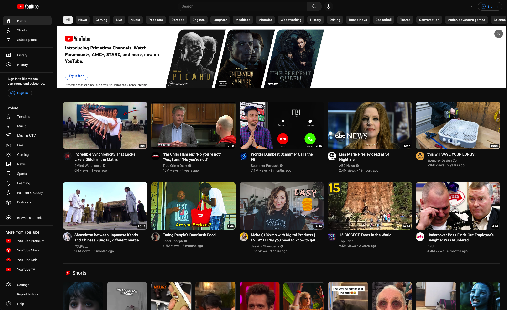

# Introduction to Full Stack

> *"There are two mistakes one can make along the road to truth: not going all the way, and not starting."*
> 
> \- Alan Cohen

As a beginner, full stack development can be quite intimidating. Looking it up yields a seemingly endless list of languages and technologies that you must learn in order to even get started, and who has time for that? The good news is that we can drastically limit the number of things to learn by making a couple of strategic decisions before we start. The bad news is that you will still have to learn about six technologies, three of which we're going to assume you have at least a basic understanding of going into the workshop series. That being said, stick with us! By the end of this, you'll have no trouble making your own full stack application to rival Facebook or Twitter and you'll have a lot of fun doing it. 

Before we get into any actual content, allow me to first give you some advice on approaching this series[^1]. At first, it's not going to be easy. It'll be frustrating and you'll bang your head against the wall and you'll want to quit. You'll want to quit often. But don't. Stick with it, and eventually you'll make progress. You'll figure out what was causing that unreadable error or that 400 response code, and the feeling of accomplishment will be like no other. Little victories will begin to pile up around you and, before you know it, you'll have a completed full stack app ready to show off to the world. It won't be easy, but nothing worth doing ever is. And keep in mind you're not on your own here! You have a team of twenty passionate, wonderful Hack officers ready to help you through your struggles. All you need to do is reach out![^2]

[^1]: And I guess learning in general.

[^2]: Which you can do in person or on [discord](https://discord.gg/T5Nu5hTs7s)!

Another piece of advice on learning: it's often helpful to start with an understanding of surface level concepts and dig deeper once you have those mastered.[^3] This is the approach we will mostly take in this workshop series. Our weekly workshops will provide a high level view of things in order to get you started, offering occasional nuggets of deeper insight, while the textbook will usually be the place to go if you want a deeper understanding. I highly recommmend utilizing both if you truly want to learn the material. If you would prefer, you can also skim the textbook ahead of our workshops and get an idea of the content that way. Whatever works best for you! Throughout the series, we'll show the entire process of building a simple full stack app. By the end, hopefully you'll be able to make your own!

[^3]: Keep in mind there are many different kinds of learners, so what works for one person may not work for another and vice versa. This is just a suggestion!

## 1.1 Prerequisites

As mentioned, due to time constraints we unfortunately won't be able to cover absolutely *everything* you need in order to make a full stack app. In particular, we'll be assuming a basic understanding of frontend concepts. This includes:

- Fundamental Coding Concepts (Think CS31)
- Basic Shell Commands (`cd`, `ls`, etc. )
- HTML/CSS
- Javascript
- React

Luckily, we had an entire workshop series[^4] covering these ideas last quarter if you need to catch up! We cover these concepts every year in Hackschool, so check out those workshop recordings/slides/README's before attending. We will be giving slight refreshers on these concepts here, but they'll be very quick and likely difficult to follow if you've never seen them before. Alright, with that out of the way... let's get to the content!

[^4]: Check out our workshops archive [here](https://hack.uclaacm.com/archive).

## 1.2 Why Full Stack?

As any good student should, you may be wondering: *What's the point?* To illustrate that, let's take a look at a website that you're probably familiar with. 

If we had to design YouTube from scratch, how might we do it? The most obvious component is the UI. It's likely that some mix of HTML/CSS is used in order to deliver the experience you see in the screenshot. There are several other things to think about, however. For instance, where do the videos come from? They're clearly not all hardcoded into the website as that would be a nightmare to maintain. You'll also notice that when you refresh the page, YouTube will adjust which videos it recommends to you to ensure it never gets stale. It takes things a step further if you sign in, tailoring its recommendations based on your previous viewing history. How are they doing this? 

Unfortunately, making a website as intricate as YouTube is impossible without incorporating the full stack. In order to store all the videos and users, something called a **database** is used. Recommendations are determined by an algorithm on a **server** and communicated to the **client** via an **API**. We'll go over exactly what all of these terms mean, but for now just know that they are each essential components of a full stack application. Each of these components works together in order to deliver a product that millions of people use everyday! And it's not just YouTube. The vast majority of websites and apps you frequent[^5] utilize all of these components in order to give you the best experience possible.

[^5]: Google, Instagram, Twitter, Facebook, BeReal. All of these are full stack applications!

Note that not all websites require the full stack. These websites are known as **static sites**, due to the fact that their content is the same for every user that visits and will not change unless the website itself is updated. One example of such a site is [Hack's website](https://hack.uclaacm.com/)!

## 1.3 What is Full Stack?

Fullstack refers to all of the technologies that are needed to complete a project. Typically, we consider full stack development to be composed of two main components called the **frontend** and **backend**. Naturally, this begs the question: what's the difference?

### Frontend

Frontend is essentially everything that the user interacts with. Think of everything that you see when you interact with a website: a text box, the colors, buttons, links, navigation bars, pages, etc. Typically, the front end is coded in HTML, CSS, and JavaScript. For our demo, we will be using React.js, which is a JavaScript library that helps us with creating our frontend. Essentially, React provides us with lots of useful library functions and integrations that abstract away many of the tedious parts of web development[^6]. 

[^6]: Such as DOM interactions. Gross.

### Backend

If we look at full stack development as an iceberg[^7], the frontend can be considered its tip. What remains deep underwater is the backend. In contrast to frontend development, backend is essentially everything that the user **does not** see. For questions like "*where does the data that I put into my text box go?*" or "*how does my website authenticate me as a proper user?*", we turn to the backend. The backend is made up of multiple parts as well. The ones that we will be focusing on are the server and the database. In order to introduce you to these technologies, let's take a look at them from a very high level.

[^7]: Which for some reason is a popular comparison.

#### What's a server?

A server is essentially a computer or program that serves as the *brains* of your application. It handles everything that our app needs in order to function, such as interacting with our database, computationally intensive tasks, user authentication, and more. There are many technologies available for servers, but here we will discuss a technology called Node in conjunction with a library called Express.  It's here that we define our backend API, which is the interface between our frontend and backend. Servers can also be referred to as backend applications.

#### What's a database?

A database is just an organized collection of data. It abstracts away the storage and retrieval of data in order to make our lives as full stack developers easier. There are several design philosophies surrounding databases, but two of the most popular are relational and non-relational (also known as NoSQL) databases. We'll briefly cover relational databases here with an emphasis placed on the non-relational side.

This was all super high level, but don't worry! We'll be going over each of these in much more detail in chapters to come.

## 1.4 MERN 

For our workshop series, we will be using the M.E.R.N. stack. Each of these letters stand for a specific technology.
- **M**ongoDB: A NoSQL database that stores all of our persistent data that the app needs to function, such as users and posts. 
- **E**xpress: A backend web application framework. 
- **R**eact.js: A frontend JavaScript library that will help us create our frontend through several useful abstractions. 
- **N**ode.js A Javscript runtime environemnt used for creating servers.

### Downloads

Before getting started, make sure you set up the required technologies!

- Download and install a text editor: [VS Code](https://code.visualstudio.com/download)
- Download and install Node.js: [Node.js](https://nodejs.org/en/download/package-manager/)
- Download and install Yarn (our package manager of choice): Run the following command after installing Node: `npm install --global yarn`[^8]
- Create a MongoDB account: [MongoDB](https://www.mongodb.com/)

You're now ready to get started!

[^8]: Or use corepack.
