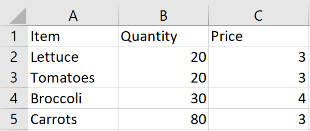
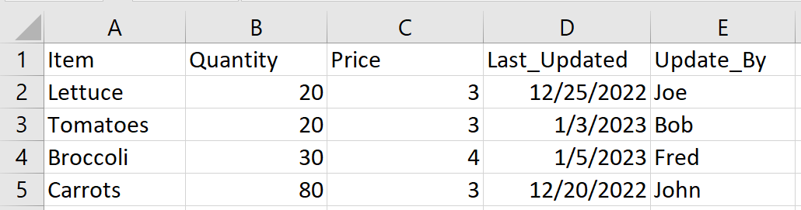
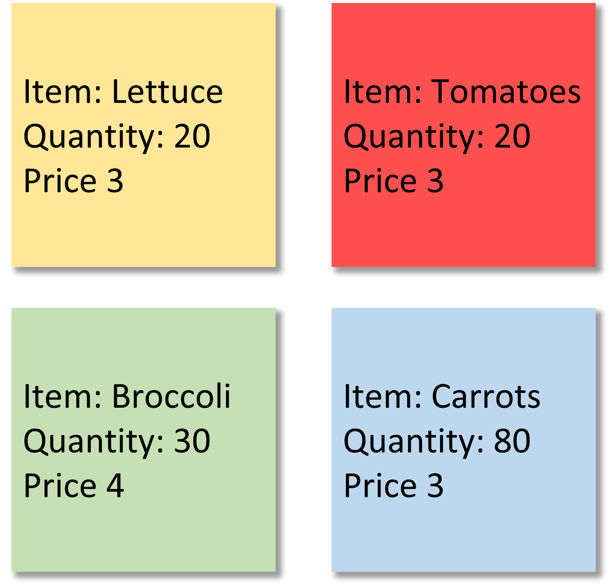

# Databases

> *"It is a capital mistake to theorize before one has data."*
> 
> \- Sherlock Holmes


As of the time of this writing, humanity has created nearly 100 zetabytes of digital data. Strongly tied to recent developments in Internet of things and machine learning, familiarity with data storage is a useful tool for any developer. But before delving into the methods and challenges associated with storing data, one may reasonably question whether there is a pressing need to store data externally for simple web applications. 

To fully address this concern, we can consider an analogy of a restaurant serving breakfast. Let's assume a new customer enters the restaurant, orders some eggs and bacon, and sits down to eat. A second customer then enters and attempts to order some eggs, only to be told by the waiter that the restaurant is short on supplies. In this scenario the restaurant dining room represents our web application, the fridge represents our **database** and the eggs represents our **data**. From this example, we note that creating a shared supply of data for many users necessitates an external database to keep things consistent. 

In addition to facilitating a shared experience between users, aggregating data in a database solves another issue: **data persistence**. Data persistence refers to the concept of any changes made by a users in an application continuing to exist, even if the application is closed or restarted. We can liken this to a customer entering a restaurant and buying their last ham sandwich on Monday, then returning on Tuesday to find the restaurant out of ham. Again in this scenario the dining room of the restaurant is akin to a web application, while the kitchen fridge represents our database and ham represents our data. 

With a strong motivation for utilizing a database, let's delve deeper into what databases actually store, common implementations, and how to interact with them.

## 2.1 Spreadsheets and Schemas 

The simplest version of a database is an unstructured file. Assuming our web application has read and write access to our file[^1], we can persist any changes even if our web application has closed. However, this implementation can be challenging to work with and is a bit more granular that we will need for our tech stack. Instead we will begin by considering its cousin, the **spreadsheet**. A spreadsheet is a file with columns and rows - effectively a large **table**. In our examples we treat each row as an individual entry in our table, and recognize each column as a a unique property of our data. Common examples of spreadsheet file types are the comma separated file format (.csv), and Microsoft Excel's various formats (.xls, .xlsx, .xlsm).




Let's modify our restaurant scenario slightly to align more closely with a traditional database. Now, instead of walking into the fridge to find and keep track of any raw ingredient, the restaurant chef can look at a note posted on the fridge that lists each item contained within. The table aboves displays a simple example of such a note. The set of column headers for this table is known as the table **schema**, representing the data type and name associated with the values along each row in the table.

As the kitchen staff remove items from the fridge to fulfill orders, we expect the quantity fields of our fridge table to decrease. Likewise, when the restaurant receives a fresh shipment of groceries we expect the associated quantity fields to increase. On the off chance that new ingredients are required, additional rows can be added to the table to display the appropriate quantity. 





In addition to the data we've elected to store, most modern databases have options to include additional columns in a table's schema known as **metadata**. Metadata refers to "data about data," and most commonly appears as a creation or modification timestamp and username, or a version id. 

## 2.2 Relational Databases and SQL

The most widely used form of a database is known as a **relational database** - one or more tables each with a fixed schema. This builds upon our previous model of a spreadsheet file and instead now makes use of an application to optimize data retrieval and modification, while still having the underlying representation. A defining feature of all relational databases is their guarantee to be **ACID** compliant, with ACID being an acronym:

- Atomic: Any operation either fully succeeds or fails and leaves the database unchanged
- Consistent: Any operation to modify data will leave data in a valid state
- Isolated: Any operation is carried out fully independently of any other operation
- Durable: Any operation, once successful, will be persist in the database.

ACID compliance eliminates common issues stemming from concurrent reads and writes to a single table, and ensures the database is always in a valid state\sidenote{When working with an ACID compliant database, we can often run many operations as a single transaction, ensuring our data can be reverted if our operation fails in the middle.}. Another key feature shared by most popular relational databases is their use of **Structured Query Language (SQL)** to interface with the database.

<details> 
<summary> 
<b>Working with SQL</b>
</summary>

SQL is the language of choice for nearly all relational databases, offering a way to view, edit, and delete data. Assuming our table in our database is named "Fridge", Below is an example query that would generate the table in the first table.

```SQL
    SELECT Item, Quantity, Price FROM Fridge
```

To create the table depicted in second table above, we would simply need to specify the additional columns present - or make use of the wildcard operator (*)

```SQL
    SELECT Item, Quantity, Price, Last_Updated, 
    Updated_By FROM Fridge
```

Now considering the case of a chef removing items from the fridge to prepare a meal, we make use of SQL's "UPDATE" and "WHERE" keyword, which lends itself to the following syntax. Note the single equal sign = acts as an assignment operator after the "SET" keyword, but ordinarily performs an equality comparison. We also see that SQL's string type is called VARCHAR, referring to a **var**iable (length) **char**acter field, and must be quoted with single quotes.  

```SQL
    UPDATE Fridge
    SET Quantity = Quantity - 1
    WHERE Item = 'Carrots' OR Item = 'Lettuce'
```

Finally, to add a new ingredient to our table, we can make use of the "INSERT" SQL operation. In the case of adding a single row we choose to use the "VALUES" variant, but can opt to use the "SELECT" variant if adding multiple rows. To set the Last_Updated metadata field, we make use a database specific date function (CURDATE() is built into MySQL). When designing our table, it would be best practice to provide this function as the default value for the Last_Updated column.

```SQL
    INSERT INTO Fridge (Item, Quantity, Price,
    Last_Updated, Updated_By)
    VALUES (
        'Spinach',
        100,
        2.5,
        CURDATE(),
        'ACMhack'
    )
 ```
    
Fortunately SQL has a very gradual learning curve for its fundamental features, making it relatively simple to jump into using it!
</details>

Beyond these features, relational databases support more advance table configurations such as constraints[^2], primary keys, and foreign keys. It is from these features - specifically the ability to enforce relationships between different schema fields and tables - that this type of database derives its name. Below are the five most popular relational databases.

1. Oracle
2. MySQL
3. Microsoft SQL Server (MSSQL)
4. PostgreSQL
5. IBM DB2

## 2.3 Non-Relational Databases

An alternative (and a better choice in certain scenarios) to a relational database is a **non-relational database**, frequently referred to as a **NoSQL database**[^3]. Like the name implies, non-relational database are structured differently from their relational counterparts. 

### Non-Relational Storage

A key distinguishing feature of a non-relational database is its lack of a rigid schema and of tables altogether. Instead we store each record of data either as **document** or a **key-value pair**. To understand the meaning and motivation behind this storage method, let's return to our restaurant scenario. Instead of displaying a table on our Fridge with information about our raw ingredients, let's instead display each ingredient on its own distinctly colored sticky note, like in image below.




This representation aligns closely with a non-relational database, with each sticky note being analogous to a single document in our database. Note that although in our example, each sticky note contained the same fields, we could add an additional fields as desired. We can call a set of documents in a non-relational database a **collection**, a concept akin to a table in a relational database.

Now imagine when the chef of our restaurant has been using this sticky note system for the last couple months and has gotten very use to it - so much so that they simply consider the sticky note color and quantity value before removing the relevant ingredients they need. Here, the sticky note color parallels the concept of a unique id field associated with each document. Similar to the chef's instinctive association of a particular color with a particular document, a non-relational database makes use of a **hash function** to map a document id to a particular document. Although the exact mechanics of these hash functions[^4] are beyond our scope, they efficiently associate an id with a document, providing the backbone for fast operations in a non-relational database. For those familiar with the concept (or those planning to take CS 32 in the future), this makes our collection a variant of a **hash table**.

### Recording Documents: JSON

In most non-relational databases (including MongoDB we'll be using in our MERN[^5] tech stack) documents are written using the JavaScript Object Notation or **JSON**. JSON syntax attempts to provide an efficient way to list a series of key value pairs. Below is a small piece of JavaScript code that would represent each of the four documents in our restaurant example. 
```js
    lettuce = {
        _id: 00000123456879,
        __v: 0,
        item: "Lettuce",
        quantity: 20,
        price: 3,
    }

    tomatoes = {
        _id: 10000123456879,
        __v: 0,
        item: "Tomatoes",
        quantity: 20,
        price: 3,
    }

    broccoli = {
        _id: 20000123456879,
        __v: 0,
        item: "Broccoli",
        quantity: 30,
        price: 4,
    }

    carrots = {
        _id: 30000123456879,
        __v: 0,
        item: "Carrots",
        quantity: 80,
        price: 3,
    }
```

In our example above, the syntax for each key-value pair is to separate the two with a colon `:`, and to comma separate each entry in any given document. The metadata fields included begin with an underscore to signify they are special fields (although the specific format will depend on the database being used). As we will see when constructing our app, modifications and additions to our data will also be formatted in JSON.

The most five most popular non-relational databases currently used are as follows

1. MongoDB
2. Redis 
3. Elasticsearch
4. DynamoDB
5. Neo4j

## 2.4 Selecting and Hosting a Database

Although we've elected to use MongoDB, a popular non-relational database as a part of the established MERN tech stack, we will briefly discuss the advantages of each type of database and how to host them. Below are the main advantages of using a relational database

1. Integrity: constraints on data can be easily set and enforced
2. Reliability: simple and efficient to backup data
3. Security: decades of strong and reliable storage methods
4. ACID Compliant: any operation on the database will be Atomic, Consistent, Isolated, and Durable
5. Transactable: can perform a series of complex operations as a single transaction (good for Online Transaction Processing  - OLTP[^6])
6. Programmability: can define stored procedures and functions to streamline queries 


Non-relational databases provide the following advantages

1. Scalability: can scale storage size and compute power
2. Open Source: source code of common databases can be analyzed and understood
3. Efficient: can perform queries faster than relational databases
4. Data Complexity: can store complex data types
5. Simplicity: simple configuration and maintenance 

As we expect to have a small number of users, would prefer a faster configuration, are not really concerned with ACID compliance or security, and would like efficient code, we choose to use a non-relational database. 

It is also important to consider the computer we will run our database on. If a single developer is designing a database, it is possible to run most types of database locally on Windows, Linux, or MacOS, saving the underlying data on your computer's local disk. Under this setup, the database will be inaccessible when the computer has been shut down, making development by other collaborators challenging. 

An alternative to hosting a database on your computer may be running the database an a dedicated computer you can guarantee will be continuously running. After configuring the connection between your web application and database computer[^7], we alleviate the issue of having our data continuously available, but introduce a new issue: we must now maintain a distinct computer dedicated for our database.

A popular alternative that facilitates collaboration is to run the database on a third-party computer with the power of **cloud computing**. Most major cloud service providers offer free storage options, enabling users to run and access a database on a computer in one of their warehouses. To make this process simpler, MongoDB has partnered with AWS, Azure and Google Cloud to offer their **MongoDB Atlas**. By creating a MongoDB Atlas account, one can easily create a database on the cloud, and connect to it from in the browser, through the command line, or through code.

## 2.5 Mongoose and Asynchronous Programming

The final step of using our hosted database is writing some code to access and manipulate our database. Here we will take advantage of a programming library to make our job a bit simpler. 

### Using Mongoose

In our restaurant analogy, after consulting the notes on the fridge, let's assume the chef must put on some slippers before entering the fridge to acquire the relevant ingredients and cook the desired meal. In our MERN tech stack, these slippers are akin to the **mongoose** library, a JavaScript Object Data Modeling library for MongoDB that simplifies the process of retrieving and modifying data in our datanbase. 

Using mongoose allows us to define an expected schema for the documents in our collection. Let's consider what creating a schema for our documents in our restaurant scenario would look like. First, we must signify our intention to use mongoose, done in the first line of the below code. We then define a new Schema, with each intended data field mapping to its relevant data type and properties. Finally, we choose to export our newly defined model so we can use it in future files.
```js
  const mongoose = require('mongoose');

  const ingredient = new mongoose.Schema({
          item: {
              type: String,
              required: true
          },
          quantity: {
              type: Number,
              required: true
          },
          price: {
              type: Number,
              required: true
          }
  });
  
  module.exports = mongoose.model('Ingredient', ingredient);
```

Mongoose also offers a wide variety of intuitive functions manipulate and add new documents to the collection with a particular schema[^8]. Below is a short list of some of the most commonly used functions, the most relevant of which we will use in our demo.

- Model.findById()
- Model.findByIdAndDelete()
- Model.findByIdAndUpdate()
- Model.find()
- Model.create()
- Model.count()
- Model.exists()

### Asynchronous vs Synchronous

In order to illustrate using Mongoose's functions, we must first address a final issue we will encounter with using our database. Returning to our restaurant analogy, we can realize that the entire process of the chef acquiring the relevant ingredients and preparing a meal will take a fair amount of time. Likewise, sending and retrieving data from our application and database may also not run instantaneously[^9].

We often choose to inform our code of this possible long wait and let our code run lines that are independent of the result in the mean time. This technique of running multiple tasks concurrently is known as **asynchronous programming**. When running JavaScript code with Node.js, we must explicitly specify a functions as asynchronous with the "async" keyword. For any operation that may pause our asynchronous function, we use the "await" keyword to signify this function should be paused until the specified line has completed. In the mean time other code not in our asynchronous function may be run.

Below is a snippet of code that builds upon our mongoose schema defined in the above code sample and defines and asynchronous function. The snippet below first includes the specified model, then defines an asynchronous function to return all documents matching our defined schema using the find() function. We return these documents by setting them in the result object.

```js
  const Ingredient = require("../models/Ingredient");

  module.exports.getIngredients = async (req, res) => {
      const ingredients = await Ingredient.find();
      res.send(ingredients);
  }
```
## 2.6 Demo

## 2.7 Testing

## 2.8 Organization

[^1]: Giving a program read access to a file allows it to open the file and access its contents. Giving a program write access allows the program to modify the contents of a file.

[^2]: Adding constraints to our database allows us to catch human errors before they snowball into larger issues.

[^3]: Some non-relational databases can be queried with SQL and SQL like languages, but most are intended to be interacted with directly through code.

[^4]: Hash functions are generally are implemented with hardware or optimized and concise software and map a unique set of input into a unique id.

[^5]: The 'M' in MERN stands for "MongoDB" - a popular non-relational database.

[^6]: Whereas an OLTP use case aligns well with a relational database, a non-relational database will likely also perform well. For Online Analytical Processing (OLAP) - performing analysis on very large datasets - a better choice would be a relational data warehouse.

[^7]: A computer used to run a database in this way is commonly called a database server. We'll talk  more about servers in chapter 3.

[^8]: These functions are part of mongoose's Application Programming Interface (API). An API is simply a term used to describe an interface to take advantage of the features of a programming library, application, or framework.

[^9]: Communicating between two distinct computers often happens over the internet a process that runs orders of magnitude slower than just running something on a single computer.
